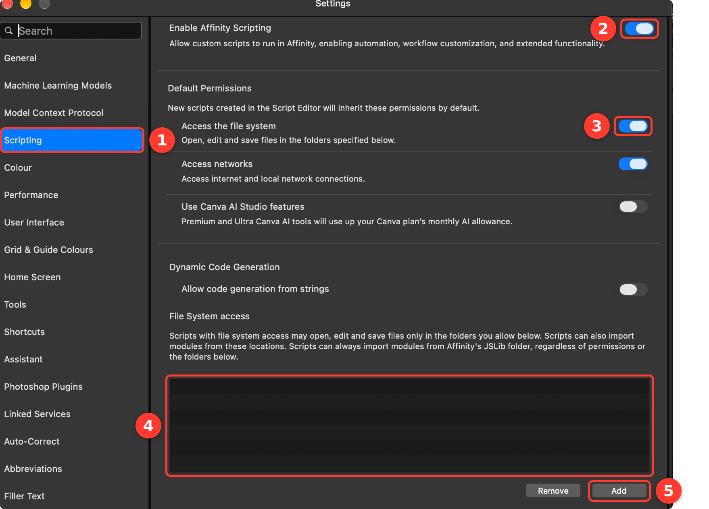
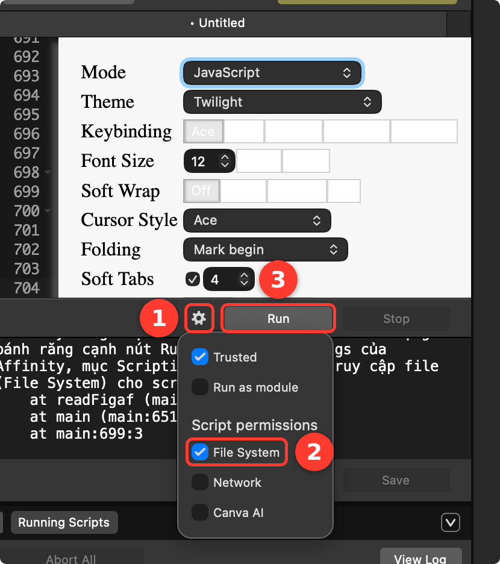
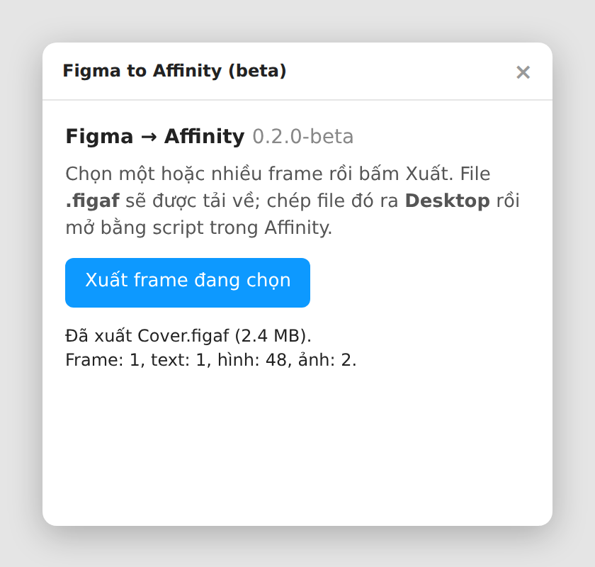

# Figma → Affinity (bản beta 0.2.0)

Chuyển thiết kế Figma thành file Affinity **chỉnh sửa được**: artboard, chữ, shape, đường cong, ảnh, mask, gradient, bóng đổ và guide đều là object gốc của Affinity, không phải ảnh dán vào.

Bộ công cụ gồm 2 phần:

- `figma-plugin/`: plugin Figma, xuất frame đang chọn ra file `.figaf`.
- `affinity-script/figaf-import.js`: script cho **Affinity 3.3 trở lên**, đọc file `.figaf` và dựng lại thành document Affinity.

> Đây là bản beta. Hãy so kết quả với Figma trước khi giao file cho khách, và gửi lỗi theo hướng dẫn ở cuối trang.

## 1. Cài đặt (làm một lần)

Tải file `figma-to-affinity-0.2.0-beta.zip` ở trang [Releases](https://github.com/nhaajtasnh/figma-to-affinity/releases) rồi giải nén. Bạn sẽ có thư mục `figma-plugin` và file `affinity-script/figaf-import.js`.

### Bước 1. Cài plugin vào Figma

1. Mở **Figma bản desktop**. Plugin cài từ file chỉ chạy trên bản desktop, không chạy trên trình duyệt.
2. Mở một file thiết kế bất kỳ.
3. Trên thanh menu, chọn **Plugins → Development → Import plugin from manifest…**
4. Chọn file `manifest.json` trong thư mục `figma-plugin`. Giữ nguyên 3 file `manifest.json`, `code.js`, `ui.html` cùng một chỗ, đừng tách ra.
5. Từ giờ plugin nằm ở **Plugins → Development → Figma to Affinity (beta)**.

### Bước 2. Bật scripting và cấp quyền thư mục trong Affinity

Affinity chỉ cho script đọc file trong những thư mục bạn cho phép. Danh sách này mặc định **trống**, nên phải thêm thư mục trước, nếu không script sẽ báo `PERMISSION_DENIED`.

Hướng dẫn này dùng **Desktop**, vì plugin cũng nhắc bạn đặt file ở đó. Bạn có thể chọn thư mục khác, miễn là sau này đặt file `.figaf` đúng vào thư mục ấy.

1. Mở **Settings** của Affinity: trên Mac chọn menu **Affinity → Settings…** (phím tắt `⌘ ,`), trên Windows chọn **Edit → Settings…**
2. Làm theo các số trong ảnh:

| Số | Việc cần làm |
|---|---|
| ① | Chọn mục **Scripting** ở cột bên trái. |
| ② | Bật **Enable Affinity Scripting**. |
| ③ | Bật **Access the file system**. Script tạo mới sau đó sẽ có sẵn quyền đọc file. |
| ④ | Đây là danh sách **File System access**. Lần đầu nó trống như trong ảnh. |
| ⑤ | Bấm **Add**, chọn thư mục **Desktop** rồi bấm **Open**. Đường dẫn Desktop (ví dụ `/Users/ten-ban/Desktop`) sẽ hiện trong danh sách ④. |

3. Đóng cửa sổ Settings.

### Bước 3. Thêm script vào Affinity

1. Trong Affinity, chuyển sang **Scripting Studio**.
2. Tạo script mới, mở file `figaf-import.js` bằng một trình soạn thảo văn bản (TextEdit, Notepad, VS Code…), copy **toàn bộ** nội dung rồi dán vào script.
3. Lưu script vào thư viện để lần sau chạy lại khỏi phải dán.
4. Kiểm tra quyền của script:

| Số | Việc cần làm |
|---|---|
| ① | Bấm **biểu tượng bánh răng** cạnh nút Run. |
| ② | Đánh dấu **File System** trong mục *Script permissions*. Nếu đã bật ③ ở Bước 2 thì ô này đã được đánh dấu sẵn. |
| ③ | Nút **Run** dùng để chạy script ở phần Sử dụng bên dưới. |

## 2. Sử dụng

1. **Trong Figma:** chọn một hoặc nhiều frame. Mỗi frame sẽ thành một artboard.
2. Mở **Plugins → Development → Figma to Affinity (beta)** rồi bấm **Xuất frame đang chọn**. Plugin báo số frame, chữ, hình đã xuất và tải file `.figaf` về (thường vào thư mục Downloads).

   

3. **Chuyển file `.figaf` vào Desktop**, hoặc vào thư mục bạn đã thêm ở Bước 2. File nằm ở Downloads thì script không đọc được.
4. **Trong Affinity:** mở Scripting Studio, chọn script vừa lưu rồi bấm **Run**. Chọn file `.figaf` khi được hỏi. Script tạo một document mới và hiện thông báo tóm tắt khi xong.
5. Kiểm tra kết quả, rồi lưu bằng **File → Save As** ra file `.af`.

Script ghi một file báo cáo `… - bao cao chuyen doi.txt` ra Desktop. Báo cáo liệt kê font máy chưa cài, layer bị lỗi, và những gì bị bỏ qua hoặc giản lược, kèm tên layer để bạn sửa tay.

### Gặp lỗi khi chạy?

| Thông báo | Cách sửa |
|---|---|
| `PERMISSION_DENIED` hoặc "Affinity không cho script đọc file" | Thư mục chứa file `.figaf` chưa có trong danh sách ④ ở Bước 2, hoặc script chưa bật **File System** (Bước 3). Kiểm tra cả hai, rồi chạy lại. |
| Không thấy mục Scripting trong Settings | Bạn đang dùng bản Affinity cũ hơn 3.3. Hãy cập nhật Affinity. |
| Không thấy menu Development trong Figma | Bạn đang mở Figma trên trình duyệt. Hãy dùng Figma bản desktop. |

## 3. Những gì được chuyển

| Trong Figma | Sang Affinity |
|---|---|
| Frame cấp cao nhất | Artboard (có nền) |
| Frame lồng bên trong | Shape cắt nội dung (khi bật Clip content), hoặc nhóm kèm nền |
| Group | Nhóm |
| Rectangle, ellipse | Shape gốc, giữ bo góc từng góc (chỉnh được độ bo) |
| Vector, star, polygon, boolean | Đường cong, sửa được từng điểm |
| Text | Chữ chỉnh sửa được: font, cỡ, màu, giãn chữ, line height, khoảng cách đoạn, canh lề, nhiều style trong một khối. Chữ một dòng tự co giãn thành Artistic Text, còn lại thành Frame Text cùng chiều rộng |
| Ảnh (fill / fit / crop) | Ảnh gốc (tối đa 4096px cạnh dài), đặt nguyên tấm trong khung, cắt lại được |
| Mask | Mask layer của Affinity |
| Nhiều lớp màu trên một shape | Nhóm gồm nhiều shape chồng lên nhau, mỗi shape một lớp màu |
| Gradient tuyến tính / tròn / góc | Gradient tuyến tính / tròn / Conical |
| Drop shadow, inner shadow, layer blur | Layer effect. Bóng đổ thứ hai trở đi và bóng không blur được dựng bằng bản sao shape nằm dưới, tên có chữ "bóng" |
| Viền | Viền, giữ độ dày, vị trí (trong/giữa/ngoài), đầu nét và góc nối |
| Layout grid dạng cột/hàng, guide | Guide |

## 4. Giới hạn đã biết

- **Auto layout** thành vị trí cố định. Component, variant, instance thành nhóm thường. Variables và prototype không được chuyển.
- **Không chuyển được** (báo cáo sẽ ghi tên layer): background blur, blend mode, lưới ô vuông, gạch chân chữ, inner shadow thứ hai trở đi trên cùng một layer.
- **Giản lược:** viền nét đứt thành viền liền. Corner smoothing (bo góc kiểu iOS) thành bo góc tròn thường. Chữ UPPER/lower được đổi hẳn thành chữ in hoa/thường. Mask độ sáng thành mask theo hình dạng.
- **Font:** máy mở file phải cài đúng font dùng trong Figma. Chữ Hán/Nhật/Hàn đặt bằng font không có các ký tự đó (ví dụ Inter) sẽ hiển thị khác nhau giữa hai phần mềm. Hãy chọn font CJK, hoặc outline nếu là logo.
- Chữ có thể lệch 1–2px theo chiều dọc do hai phần mềm tính line height khác nhau.
- Hai hình có mép trùng khít nhau có thể lộ một vệt mảnh dưới 1px khi zoom lớn. Thường không thấy khi export ở kích thước thật. Muốn sạch hẳn thì phóng to hình phía dưới thêm khoảng 1px.

## 5. Tuỳ chỉnh

Các tuỳ chọn nằm ở đầu file `figaf-import.js`:

| Tuỳ chọn | Mặc định | Ý nghĩa |
|---|---|---|
| `ROUND_TO_PIXEL` | `true` | Làm tròn vị trí và kích thước về số nguyên pixel. Hình xê dịch tối đa 0,5px so với Figma |
| `MASK_AS_LAYER` | `true` | Dựng mask thành mask layer. Đặt `false` để dùng cách clip vào shape |
| `ADD_GUIDES` | `true` | Chuyển layout grid và guide thành guide |
| `SHADOW_BLUR_SCALE` | `1.0` | Hệ số độ mờ bóng đổ |
| `DEBUG` | `false` | In chi tiết từng layer ra console, dùng khi báo lỗi |

## 6. Báo lỗi

Khi kết quả khác Figma, vui lòng gửi:

1. **Ảnh chụp so sánh** Figma và Affinity ở cùng vùng bị lỗi.
2. **File báo cáo** `… - bao cao chuyen doi.txt` trên Desktop. Dòng đầu tiên ghi phiên bản plugin và script.
3. **Log chi tiết:** mở script, đổi `DEBUG = false` thành `true`, chạy lại, rồi copy toàn bộ nội dung trong console của Scripting Studio.
4. Nếu được, gửi kèm file `.figaf` hoặc file Figma (chỉ phần bị lỗi).

## Giấy phép

MIT, xem file [LICENSE](LICENSE).
